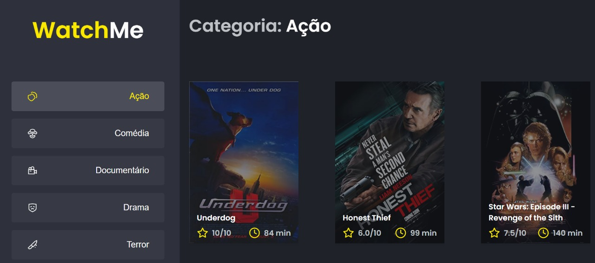

# ignite-reactjs-desafio02

# 💻 Sobre o desafio

Nesse desafio, você deverá criar uma aplicação para treinar o que aprendeu até agora no ReactJS

Essa será uma aplicação onde o seu principal objetivo é refatorar uma página para listagem de filmes de acordo com gênero.

A aplicação já está totalmente funcional mas grande parte do seu código está diretamente no arquivo `App.tsx`. Para resolver isso da melhor forma, é necessário dividir a aplicação em **pelo menos** duas partes principais: sidebar e o conteúdo principal que possui o header e a listagem de filmes.

-   **src/App.tsx**
    Esse componente contém toda a aplicação com exceção do componente `Button` que não precisa ser alterado e `Icon` que também não precisa de alteração.
-   **src/components/Content.tsx**
    Esse componente, ainda vazio, deve possuir toda a lógica e corpo responsável pelo header e conteúdo da aplicação (seção contornada em vermelho):
-   **src/components/SideBar.tsx**
    Esse componente, também vazio, deve possuir toda a lógica e corpo responsável pela seção que contém o título do site e a parte de navegação à esquerda da página (seção contornada em vermelho):

  

Feito com ❤️ por Daniel Braz 👋🏻 <a href="https://www.linkedin.com/in/drzbraz/">Linkedin</a>

